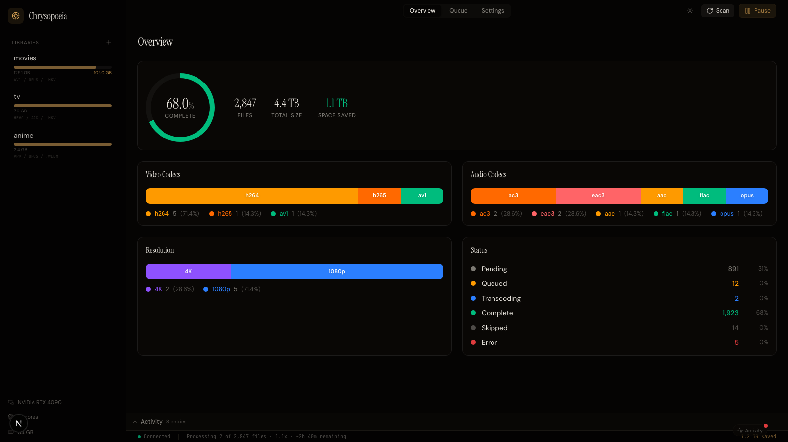

Chrysopoeia is a self-hosted media transcoder that automatically converts entire libraries to patent-free formats like AV1 and Opus. It detects available hardware encoders at startup and selects the fastest encoding path — NVENC, VAAPI, QSV, or software fallback — without manual configuration.

## Screenshots

## How it works

Point Chrysopoeia at your media directories and choose an output format. It scans every file with ffprobe to identify codecs, resolution, and bitrate, then queues anything that isn't already in the target format. Files already encoded in AV1, VP9, or Opus are skipped automatically.

Each library can have its own encoding profile. A movies folder might target AV1 at CRF 28 while a TV folder uses HEVC at CRF 24. The transcoding engine spawns ffmpeg with the correct encoder and hardware acceleration flags, parses real-time progress from the process, and streams updates to the browser over WebSocket.

The dashboard provides a Tdarr-style overview with codec distribution charts, a processing queue with per-file circular progress indicators, and per-library settings. Everything runs in a single Docker container with an embedded SQLite database.

## Stack

- Rust (Axum, SQLx, Tokio) for the backend server and transcoding orchestration
- FFmpeg for encoding with hardware acceleration (NVENC, VAAPI, QSV, VideoToolbox)
- OxiMedia integration path for pure-Rust patent-free encoding
- Next.js 15 with shadcn/ui for the web dashboard
- SQLite with WAL mode for metadata and job persistence
- Docker with optional NVIDIA GPU passthrough

## Status

In progress
