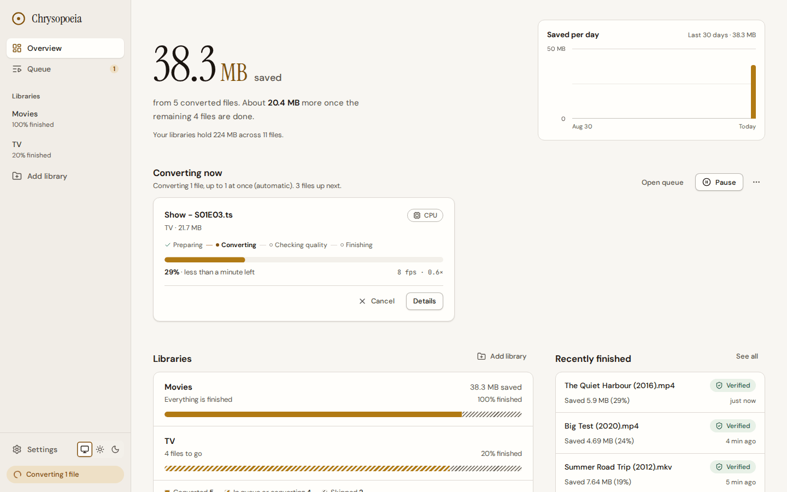
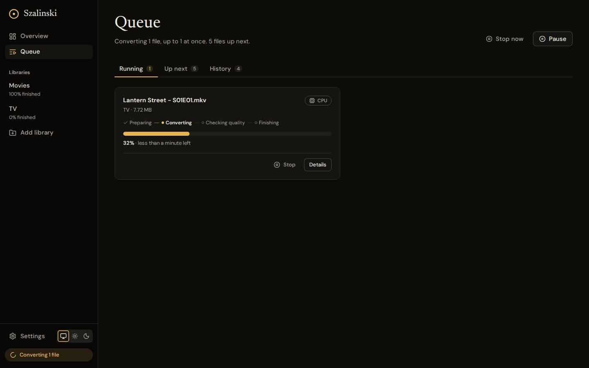
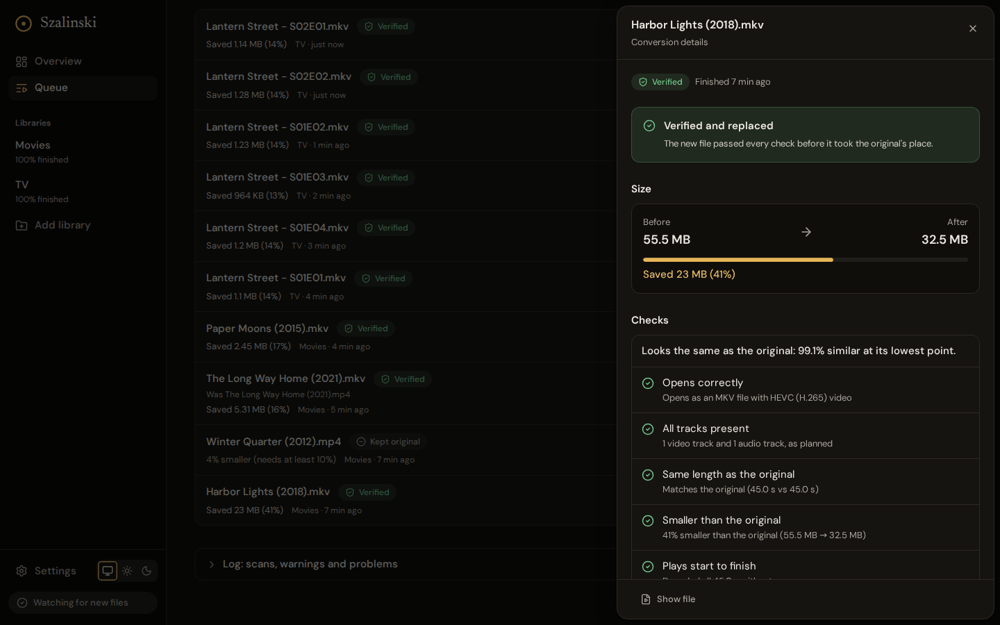
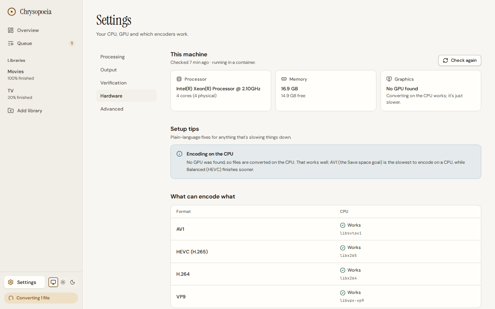
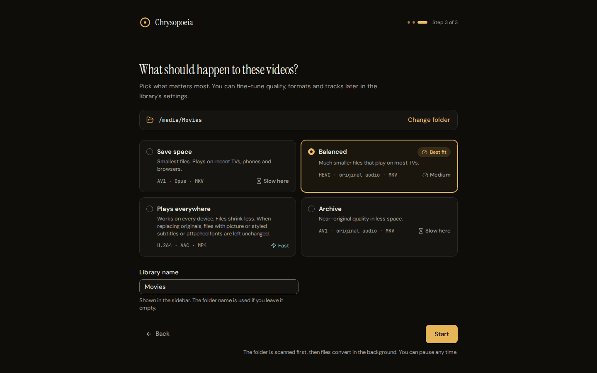
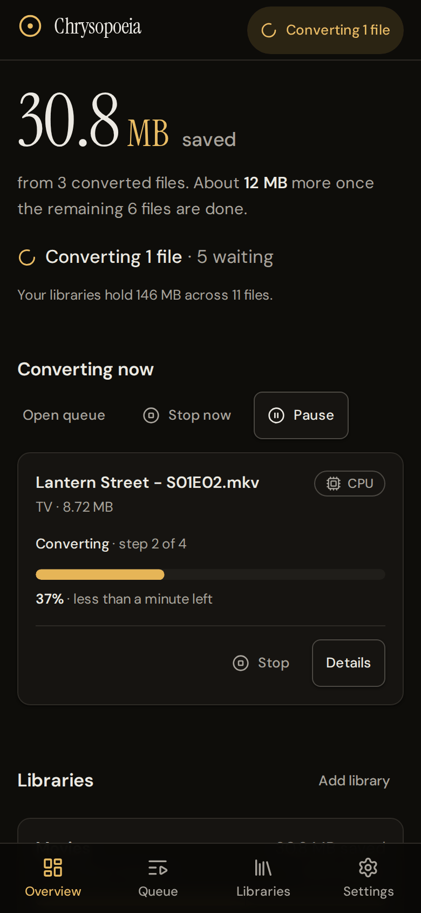

# Chrysopoeia

Chrysopoeia converts your whole media library to smaller or more compatible
video in the background: point it at a folder, pick a goal, and it handles the
rest. Every new file is decoded end to end and visually compared with the
original before it is allowed to replace it.

It runs as one Docker container with one web page, on Unraid or any Linux,
Windows or macOS machine that runs Docker (or natively on a Mac).



<table>
  <tr>
    <td width="50%"></td>
    <td width="50%"></td>
  </tr>
  <tr>
    <td align="center"><sub>The Queue, with a conversion running</sub></td>
    <td align="center"><sub>A finished file, with the checks that let it replace the original</sub></td>
  </tr>
  <tr>
    <td width="50%"></td>
    <td width="50%"></td>
  </tr>
  <tr>
    <td align="center"><sub>Settings › Hardware, <em>This machine</em></sub></td>
    <td align="center"><sub>First run: choose a folder, then a goal</sub></td>
  </tr>
</table>

<p align="center"></p>

## Why Chrysopoeia

Tdarr is a powerful, flexible tool built around plugin stacks and separate
worker nodes. Chrysopoeia is deliberately narrower, and aims to be as robust
while asking far less of you:

- **Goals instead of plugins.** Choose *Save space*, *Balanced*, *Plays
  everywhere* or *Archive*. Codec, container, quality and audio handling follow
  from that; every setting can still be changed under *More format options*.
- **One container, nothing to wire up.** The server, the job queue, the workers
  and the web UI are a single process on port 8080. No nodes, no separate
  database.
- **Hardware set up for you.** On start it finds your GPUs, runs a one-second
  test encode on each hardware encoder, and only uses the ones that actually
  work. The number of files to convert at once is worked out from your CPU
  cores, memory, container limits and GPU.
- **Verified before replaced.** Each result must decode cleanly from start to
  finish, keep the expected streams and duration, and match the original
  visually (SSIM at several points in the file). Only then is the original
  swapped out, in a way that survives crashes and power loss.
- **Plain explanations.** Every skipped or failed file says why, in a sentence.
  Setup problems, such as a GPU the container cannot see or a read-only media
  folder, are listed under *Needs your attention* on the Overview with the
  exact setting to change.

## Features

- Inputs: anything ffmpeg can read (MKV, MP4, AVI, MPEG-TS, MOV, WMV, ...).
- Outputs: AV1, HEVC (H.265), H.264 or VP9 video in MKV, MP4 or WebM; audio kept
  as-is or converted to Opus, AAC, FLAC, AC-3, E-AC-3, MP3 or Vorbis.
- Hardware encoding: NVIDIA NVENC, Intel Quick Sync, VA-API (Intel and AMD),
  Apple VideoToolbox, plus CPU encoders (SVT-AV1, x265, x264, libvpx). If a
  hardware encode fails, the file is retried on the CPU automatically.
- Keeps subtitles, fonts, cover images, chapters, metadata, HDR signalling and
  10-bit colour where the target allows; deinterlaces broadcast recordings; skips
  files that are already efficient.
- Never loses part of a file by replacing it: when the target format can't hold
  something the original has (picture subtitles, styled ASS/SSA subtitles, fonts
  and other attachments, or a cover image that MP4 or WebM can't store), the file
  is skipped, the reason is shown and the original stays as it is. An MKV goal
  keeps it all, and covers are kept in MKV and, if JPEG, PNG or BMP, in MP4. With
  an output folder or *Convert anyway* the file is converted and each loss is
  noted on the job.
- Watches folders and picks up new files, with an optional schedule (*When to
  convert*), pause, priorities and retry.
- Replaces originals in place, or writes to a separate output folder and leaves
  originals alone. The converted file gets the new container's extension, so
  `Movie.mp4` becomes `Movie.mkv`: Plex, Jellyfin and Emby pick that up at their
  next scan, while Sonarr and Radarr see the old file as missing until their next
  disk scan or a *Refresh & Scan* of the series or movie (see the
  [FAQ](#faq)). History and *Recently finished* show the new name with the old
  one under it (*Was Movie.mp4*), and a library's search finds the file by
  either.

### Goals

| Goal | Video | Audio | Container | Keeps the result only if |
|---|---|---|---|---|
| Save space | AV1 | Opus | MKV | at least 10% smaller |
| Balanced | HEVC | original | MKV | at least 10% smaller |
| Plays everywhere | H.264 | AAC | MP4 | always (compatibility is the point) |
| Archive | AV1, highest quality | original | MKV | at least 5% smaller |

The first-run screen suggests the goal that suits the machine (the *Best fit*
badge) and shows how fast each goal converts on it. When originals are replaced,
*Plays everywhere* skips a file that has picture subtitles, styled subtitles or
attachments MP4 can't hold, instead of trimming it (see the [FAQ](#faq)).

## Quick start

> **Installing before the first release, or from a branch?** The addresses and
> the image in this section belong to the `main` branch and to the image
> `ghcr.io/thekozugroup/chrysopoeia:latest` that its Release workflow publishes.
> Until the project is merged to `main`, that workflow has run, and the package
> has been made public, the template and icon addresses answer *404*, the compose
> file address may still serve an older, incompatible file, and pulling
> `:latest` is *denied*. Until then, do one of these:
>
> - **Use the branch.** In every `raw.githubusercontent.com` address, replace
>   `main` with the branch's name (a pushed branch serves the same files), and
>   use the image `ghcr.io/thekozugroup/chrysopoeia:edge` instead of `:latest`.
>   Run **Actions › Release › Run workflow** on the branch to publish it, and
>   make the package public once (see [Which image](#which-image)).
> - **[Build the image yourself](#build-it-yourself)**, about 15 minutes, and
>   use the local image (`chrysopoeia:local`) wherever `:latest` appears below.

### Unraid

1. For hardware encoding, first install the driver plugin from the **Apps**
   tab: **Intel GPU TOP** (Intel), **Radeon TOP** (AMD) or **Nvidia-Driver**
   (NVIDIA). CPU-only works without any plugin.
2. Install **Chrysopoeia** from the **Apps** tab. Until it is listed there,
   add the template by its URL from the Unraid terminal (the `>_` icon):

   ```sh
   wget -O /boot/config/plugins/dockerMan/templates-user/my-Chrysopoeia.xml \
     https://raw.githubusercontent.com/thekozugroup/Project-Chrysopoeia/main/unraid/chrysopoeia.xml
   ```

   then open **Docker › Add Container** and pick *Chrysopoeia* from the
   *Template* list.
3. Set **Media** (required) to the share that holds your videos, for
   example `/mnt/user/media/`, rather than all of `/mnt/user/`. Optionally set
   **Transcode cache** to a folder on your SSD pool. Intel or AMD: click *Add
   another Path, Port, Variable, Label or Device*, choose *Device* and enter
   `/dev/dri`. NVIDIA: switch the editor to *Advanced View* (top right), add
   `--runtime=nvidia` to *Extra Parameters*, and set `NVIDIA_VISIBLE_DEVICES`
   (under *Show more settings*) to `all`.
4. Click **Apply**, then open the web UI from the container's icon, choose a
   folder under `/media` and a goal.

The full walkthrough, including GPU passthrough, the transcode cache, reverse
proxies and troubleshooting, is in [docs/UNRAID.md](docs/UNRAID.md).

### docker run

```sh
docker run -d --name chrysopoeia --restart unless-stopped \
  -p 8080:8080 \
  -v /srv/chrysopoeia:/config \
  -v /srv/media:/media \
  -e PUID=1000 -e PGID=1000 -e TZ=Europe/London \
  ghcr.io/thekozugroup/chrysopoeia:latest
```

Use the owner of your media for `PUID`/`PGID` (`stat -c '%u %g' /srv/media`).
Optional: `-v /fast/ssd/chrysopoeia-temp:/temp` keeps in-progress files on a
fast disk. Add a GPU with one extra flag (more in [GPU setup](#gpu-setup)):

```sh
# Intel or AMD
--device /dev/dri:/dev/dri
# NVIDIA (needs the NVIDIA Container Toolkit on the host)
--gpus all                                    # one card: --gpus device=GPU-<uuid>
# NVIDIA through the runtime instead (what Unraid uses)
--runtime=nvidia -e NVIDIA_VISIBLE_DEVICES=all   # one card: its UUID instead of all
```

Then open `http://<server>:8080`.

### Docker Compose

```sh
curl -O https://raw.githubusercontent.com/thekozugroup/Project-Chrysopoeia/main/docker-compose.yml
curl -o .env https://raw.githubusercontent.com/thekozugroup/Project-Chrysopoeia/main/.env.example
# edit .env: MEDIA_PATH, PUID, PGID, TZ
docker compose up -d
```

To run another image than `:latest` (the `:edge` test build, or one you
[built yourself](#build-it-yourself)), add a line to `.env`, for example
`CHRYSOPOEIA_IMAGE=chrysopoeia:local`.

With a GPU, download the matching overlay file too and name both files:

```sh
docker compose -f docker-compose.yml -f docker-compose.nvidia.yml up -d      # NVIDIA
docker compose -f docker-compose.yml -f docker-compose.intel-amd.yml up -d   # Intel / AMD
```

### The first run

Open the web UI. The welcome page says which GPU was found (or that your CPU
will do the work). **Choose a folder** opens a folder browser at `/media`: open
the folder you want converted and click the button that names it, **Use
“Movies”**. Then pick a goal and click **Start**. Chrysopoeia scans the folder,
queues the files that need work and starts converting; the Overview shows the
space saved and what is happening now. Add more folders later with **Add
library**. A library can't be `/`, `/config`, `/app`, `/proc`, `/sys` or `/dev`,
or a folder inside one of them: the picker disables the button and says why, and
the same rule applies to `LIBRARIES`.

### Which image

Images are published to `ghcr.io/thekozugroup/chrysopoeia` for `linux/amd64`
and `linux/arm64`:

| Tag | What it is |
|---|---|
| `latest` | The newest tested build of the `main` branch. |
| `1.2.3`, `1.2`, `1` | A release (a `v1.2.3` tag); `1` follows the newest 1.x. |
| `edge` | A test build of a branch that is not merged yet. It is published when someone runs **Actions › Release › Run workflow** on that branch, and never changes `latest`. |
| `sha-<commit>` | One exact commit. |

Versions before 1.0 are tagged `0.2.3` and `0.2` only; the `1` tag starts with
version 1.0.

To try a branch before it is merged, run the Release workflow on it, then pull
`ghcr.io/thekozugroup/chrysopoeia:edge` (Unraid: set the container's
*Repository* to that). After the merge to `main`, switch back to `:latest`. The
very first image creates the package as private; make it public once in
GitHub › Packages › chrysopoeia › Package settings.

The Unraid template's `Icon` and `TemplateURL` point at the `main` branch, so
the icon and the template's own updates appear only once the template is on
`main`. The image itself does not depend on that.

### Build it yourself

When the published image is not available yet (see the note at the top of
[Quick start](#quick-start)), or you want to run your own changes, build the
image from the source. You need Docker 23 or newer (it includes BuildKit). The
first build takes 10 to 15 minutes on a four-core machine and needs about 8 GB
of free disk space while it runs (build tools and their cache; afterwards
`docker builder prune -af` gives back about 3 GB of it). The finished image is
about 600 MB (150 MB compressed). Later builds reuse the cached steps: a change
to the web pages alone takes a couple of minutes.

```sh
git clone https://github.com/thekozugroup/Project-Chrysopoeia.git
cd Project-Chrysopoeia          # for a branch that is not merged yet: git checkout <branch>
docker build -t chrysopoeia:local --build-arg VERSION=local .
```

No `git`? Download the branch as an archive instead (replace `main` with the
branch name):

```sh
curl -L https://github.com/thekozugroup/Project-Chrysopoeia/archive/refs/heads/main.tar.gz | tar xz
cd Project-Chrysopoeia-*
docker build -t chrysopoeia:local --build-arg VERSION=local .
```

Then use `chrysopoeia:local` in place of `ghcr.io/thekozugroup/chrysopoeia:latest`
in the `docker run` command, or as `CHRYSOPOEIA_IMAGE` for Compose. An image
built without `--build-arg VERSION=...` shows *dev* as its build in *About* and
in the first log line. Building for a server with a different kind of
processor than the build machine (an Apple Silicon Mac for an Intel or AMD
server)? Add `--platform linux/amd64` (or `linux/arm64`).

**On Unraid** the easiest way is to build on another machine that has Docker
and send the image over:

```sh
docker save chrysopoeia:local | ssh root@tower docker load
```

You can also run the commands above in the Unraid terminal, but Docker keeps
the build and its cache in `docker.img`, which also holds all your other
containers and may be only 20 GB: do it only when `docker.img` has about 10 GB
free, and run `docker builder prune -af` afterwards.

Then **Edit** the container (or Add Container) and set **Repository** to
`chrysopoeia:local`. There is no registry to check for a local image, so to
update it, build again and then recreate the container with **Edit › Apply**.

## GPU setup

Chrysopoeia uses whichever encoders pass its test encode, so the only job is
making the GPU visible to the container. **Settings › Hardware** in the app
(the page headed *This machine*) shows what was found and, if something is
missing, the exact fix. Under *Details: encoders and ffmpeg*, each format shows
*Works* once its test encode has passed on this machine.

| Hardware | Host needs | Container needs | Encodes in hardware |
|---|---|---|---|
| NVIDIA GeForce / RTX / Quadro | NVIDIA driver + NVIDIA Container Toolkit (Unraid: Nvidia-Driver plugin) | `--gpus all`, or `--runtime=nvidia` and `NVIDIA_VISIBLE_DEVICES=all` | H.264 (Kepler+), HEVC (GTX 950 and newer), AV1 (RTX 40 and newer); the GT 1030 and most MX laptop chips have no encoder |
| Intel iGPU or Arc | `i915` or `xe` driver loaded, `/dev/dri` present (Unraid: Intel GPU TOP plugin) | `--device /dev/dri` (Unraid: a Device `/dev/dri`) | H.264, HEVC (6th gen+), AV1 (Arc, Core Ultra) |
| AMD Radeon / Ryzen APU | `amdgpu` driver, `/dev/dri` present (Unraid: Radeon TOP plugin) | `--device /dev/dri` (Unraid: a Device `/dev/dri`) | H.264, HEVC (RX 400 and newer), AV1 (RX 7000 and newer) |
| Apple Silicon Mac | nothing: run Chrysopoeia natively, not in Docker (Docker on macOS cannot reach the GPU) | n/a | H.264, HEVC |
| Raspberry Pi 4 | 64-bit OS | `--device /dev/video11` (encoder) | H.264 only; the Pi 5 has no hardware encoder |

No GPU at all is fine: CPU encoding is slower but gives the smallest files. The
detailed support matrix, including older GPUs and ARM boards, is in
[docs/HARDWARE.md](docs/HARDWARE.md).

`HW_ACCEL=auto` (the default) uses the best encoder that passes its test and
the CPU otherwise. To pin one kind, set `HW_ACCEL` to `nvenc`, `qsv` or
`vaapi`, or choose it in Settings › Hardware under *Use for converting*.

## Configuration

Almost everything is set in the web UI. The container reads these environment
variables; empty values count as not set.

| Variable | Default | What it does |
|---|---|---|
| `PUID` / `PGID` | `1000` / `1000` | User and group Chrysopoeia runs as and writes files as. Use the owner of your media (Unraid: `99` / `100`). |
| `UMASK` | `002` | Permissions for what Chrysopoeia creates itself, such as work files and folders in an output folder (`002`: the group can edit them; `022`: only the owner). A converted file keeps the permissions of the original it replaces. |
| `TZ` | `UTC` | Time zone (e.g. `Europe/London`) for the *When to convert* schedule in Settings › Processing. Unraid sets it for you. Log lines are always stamped in UTC. |
| `HW_ACCEL` | `auto` | Hardware preference: `auto`, `cpu`, `nvenc` (NVIDIA), `qsv` (Intel), `vaapi` (Intel or AMD), `amf` (AMD's proprietary driver, not in the image), `rkmpp` (Rockchip), `v4l2m2m` (Raspberry Pi 4) or `videotoolbox` (native macOS only). A GPU choice uses only that kind of GPU; files go to the CPU when it is missing or cannot encode the chosen format (Settings › Hardware, under *Details: encoders and ffmpeg*, shows *Works* for each format its test encode passed). Applied on the first start, and again on the next start whenever you change its value; in between, the choice in Settings › Hardware is kept. `auto` never overrides a choice made in the app. |
| `MAX_JOBS` | automatic | Files converted at once, 1 to 32. Stands in for the automatic count while *Files at once* is *Automatic* in Settings › Processing; a number chosen there wins. |
| `LIBRARIES` | none | Comma-separated folders (container paths) to add as libraries on first start, e.g. `/media/Movies,/media/TV`. They start with the *Save space* goal and begin converting at once; change a library's goal in its own Settings tab. Leave it empty to choose folder and goal in the first-run screens. |
| `ALLOWED_HOSTS` | none | Domain names the web UI may be opened at, comma-separated, e.g. `transcode.example.com`. Only needed behind a reverse proxy; see [below](#behind-a-reverse-proxy). |
| `TEMP_DIR` | `/temp` if mounted | Where in-progress files go. Unset and no `/temp` mount: next to each original. Settings › Output, under *Work folder*, can choose another folder. |
| `BROWSE_ROOTS` | `/media,/` if `/media` is mounted | Folders the in-app folder picker starts from. |
| `NVIDIA_VISIBLE_DEVICES` | unset | NVIDIA with `--runtime=nvidia` (Unraid): `all` or a GPU UUID. With `--gpus` or the compose overlay, Docker sets it from the GPUs chosen there. |
| `NVIDIA_DRIVER_CAPABILITIES` | `compute,video,utility` | Already set in the image; `video` is what enables NVENC. |
| `PORT` | `8080` | The port the server listens on inside the container; leave it alone unless you also change what you publish (`-p 9000:9000`). To use another port on the host, change the left number of `-p` (`-p 9000:8080`), the Unraid *Web UI port*, or, for the compose file, `PORT` in `.env`: that one is the host port, and the container stays on 8080. |
| `LOG_LEVEL` | `info` | `error`, `warn`, `info`, `debug` or `trace`. |
| `CHRYSOPOEIA_VERSION` | set by the image | The build label (a release such as `1.2.3`, or `<branch>-<commit>`; *dev* for an image built without `--build-arg VERSION`). Shown in the first log line and under *About* at the bottom of Settings, both as the *build*; do not set it. |

The image also sets `DATA_DIR`, `WEB_DIR`, `FFMPEG_PATH` and `FFPROBE_PATH`;
leave them as they are.

| Path | Purpose |
|---|---|
| `/config` | Database and settings. Small; back it up. |
| `/media` | Your media. Needs write access so originals can be replaced. |
| `/temp` | Optional scratch space on a fast disk (SSD or cache pool). |

Each container needs its own `/config` folder. A second one started on the same
folder stops at once and says *Another Chrysopoeia is already using the data
folder /config*, so nothing is changed; give it its own folder (Unraid: the
Config path; docker: `-v /other/folder:/config`) or stop the first. If the disk
that holds `/config` is full, the start fails with *The disk that holds the data
folder (/config) is full, so the database there couldn't be opened*: free some
space there and start it again.

### Behind a reverse proxy

Chrysopoeia answers on its IP address, `localhost` and local names (`tower`,
`tower.local`, `nas.lan`, `*.home.arpa`, `*.ts.net` and similar) without any
setup. So that a hostile website cannot reach it through a look-alike domain,
any other name must be listed in `ALLOWED_HOSTS`; until it is, the app shows
*Chrysopoeia doesn't answer to the address "…"* with the line to add and, for
nginx, the `proxy_set_header Host $http_host;` hint.

- Set `ALLOWED_HOSTS=transcode.example.com` (several: separate with commas; a
  leading dot, `.example.com`, allows every name under that domain).
- The proxy must pass on the address the browser used (the `Host` header),
  because Chrysopoeia compares it with the page a change comes from. Nginx
  Proxy Manager, SWAG, Traefik and Caddy do this already. Plain nginx and
  Apache do not by default: without it the page opens, but every change and
  the live updates are refused with *This request came from another website,
  so Chrysopoeia refused it*.
- Enable WebSocket support for the proxy host (Nginx Proxy Manager:
  *Websockets Support*). Live progress uses `/api/ws`.
- There is no login yet: add authentication at the proxy (for example
  Authelia, Authentik or basic auth) before exposing it outside your network.

A plain nginx `server` block needs these lines (Apache: `ProxyPreserveHost On`
plus WebSocket proxying for `/api/ws`):

```nginx
location / {
    proxy_pass http://192.168.1.10:8080;        # the server running Chrysopoeia
    proxy_set_header Host $http_host;           # keep the address the browser used
    proxy_http_version 1.1;                     # live updates (WebSocket)
    proxy_set_header Upgrade $http_upgrade;
    proxy_set_header Connection "upgrade";
    proxy_read_timeout 1h;
}
```

## Upgrading

Pull the new image and recreate the container. Your libraries, settings and
history live in `/config` and are kept.

- **Unraid:** Docker tab › *Check for Updates* › *apply update*.
- **docker run:** `docker pull ghcr.io/thekozugroup/chrysopoeia:latest`, then
  `docker rm -f chrysopoeia` and run the same `docker run` command again.
- **Compose:** `docker compose pull && docker compose up -d`.

Files that were converting are stopped, their work files removed, and they
start again from the beginning; an original is never left half-replaced. The
database is upgraded in place on the first start of a newer version. A newer
database is refused by an older image with a plain message, so to go back to an
older version, restore a backup of `/config` taken before the upgrade. To see
which build is running, open the bottom of Settings (*About*) or the first
lines of the container log; `docker ps` shows *healthy* once the web UI answers
again.

## Backing up

Everything Chrysopoeia keeps is in `/config`: the database with your libraries,
settings and history (`chrysopoeia.db`, plus its `-wal` and `-shm` files while
it runs). Copy the folder while the container is stopped, or use your usual
appdata backup (Unraid: the *Appdata Backup* plugin stops containers while it
copies). Your media is not stored there, and nothing in it changes if `/config`
is lost: add the libraries again, with the same goal as before, and files that
were already converted are recognised as efficient and skipped. Only history
and statistics are lost. Files that had been tried but kept as originals
because the result was not enough smaller are tried again, and converting them
again takes as long as the first time; a different goal converts everything
again. Chrysopoeia is not a backup tool either: keep a backup of media you
cannot replace.

## FAQ

**Are my originals safe?**
Chrysopoeia never writes over a file it has not verified. Each conversion goes
to a hidden temporary file; after it passes verification, the original is
renamed to a hidden backup, the new file is moved into place, and only then is
the backup deleted. If the power fails or the container stops halfway, the
next start finds the backup and puts it back. A failed or stopped job leaves
the original untouched, and so does a file that was replaced or deleted while
it was converting (for example by Sonarr or Radarr). If you would rather keep
originals, choose *Save to a separate folder* in Settings › Output and
Chrysopoeia will never modify your library. As with any tool that rewrites
files, keep a backup of media you cannot replace.

**Why did the file extension change?**
The converted file is named for the container the goal writes: `.mkv` for *Save
space*, *Balanced* and *Archive*, `.mp4` for *Plays everywhere*, or whatever you
chose under *More format options*. `Movie.mp4` becomes `Movie.mkv`, and an
`.mkv` becomes `.mp4` under *Plays everywhere*; a file that is already in that
container keeps its name. Because the old path then no longer exists, Plex,
Jellyfin and Emby pick up the new name at their next library scan, while Sonarr
and Radarr show the file as missing until their next disk scan or until you
run *Refresh & Scan* on the series or movie. In History and *Recently finished*
the file appears under its new name with *Was Movie.mp4* beneath it, and the
library's search finds it by the old name too. To keep names as they are,
choose a goal whose container matches your files (*Balanced* for a library of
`.mkv` files), or *Save to a separate folder*.

**What does "Verified" mean?**
The new file was opened and checked before it replaced the original. With the
default *Standard* level (Settings › Output, under *Checks before replacing*)
that means: it has the expected video, audio and subtitle streams in the target
codec; its duration matches the original; it decodes from start to finish
without a single error; and at four points in the file its picture was compared
with the original (SSIM, a standard measure of visual similarity), catching
green frames, blocking and other corruption. *Thorough* samples ten points and
also checks for added black or frozen frames; *Quick* only checks streams and
duration. To see what was checked for a file, open it in the Queue (under
*History*): the **Checks** list shows each one. If a check fails, the original
is kept and the file says why.

**What does "Needs your attention" mean?**
It appears on the Overview only when something needs you, grouped by cause,
each with its fix and, where trying again can help, a **Try again** button:

- *Hardware setup needs a fix*, or *Nothing can be converted until setup is
  fixed*: a GPU the container cannot see, or ffmpeg missing. Settings ›
  Hardware has the exact steps.
- *The work folder can't be used*, *Finished files can't be saved*, *The disk
  is full*, *The hardware you chose isn't working*: a setup problem. Fix it
  once, then **Try again** queues every file that waited on it.
- *N files can't be read*: the original looks damaged or is not a video. It is
  left alone.
- *N files couldn't be converted*: the encoder or the checks failed. The
  originals are untouched; the file's page says why.
- *N files changed or moved while being converted*: nothing was replaced.
- *Movies: the folder can't be read* (a library's name comes first): the folder
  is missing, offline, or on a share or drive that isn't responding (see *What if
  a network share or drive stops answering?* below).

**Why was a file skipped?**
The reason is shown next to the file. The usual ones: the video is already as
efficient as the target (for example it is already AV1); it is audio-only; it
could not be read or is shorter than a second; the converted file was not
enough smaller to be worth keeping (the original is kept); it is HDR and the
goal is H.264 (tone mapping is not supported yet); it is Dolby Vision profile 5,
whose colours cannot be kept; it has another hard link (a torrent that is still
seeding), so replacing it would use more space instead of saving it; the goal
saves to MP4 or WebM (for example *Plays everywhere*) and the file has something
that format can't hold; or you skipped it.

When the format can't hold something, replacing the file would lose it, so the
original is left alone and the reason says what: *MP4 can't hold this file's 2
picture-based subtitles, 1 styled subtitle and 1 subtitle font, so it was left
unchanged.* That covers picture-based subtitles (PGS, VobSub), styled ASS/SSA
subtitles (MP4 and WebM keep only their text), fonts and other attached files,
and cover images the format can't store (WebM holds none; MP4 holds JPEG, PNG
and BMP). An MKV goal keeps everything, and *Save to a separate folder*
converts the file while the original stays.

*Convert anyway* on a skipped file converts it once, ignoring the library's
rules for skipping (the usual checks still run). What the format can't hold is
left out and noted on the job; a file with another hard link ends as
*Converted, no space freed*.

**How many files convert at once?**
By default it is automatic (*Files at once* in Settings › Processing). On the
CPU: one per four cores (1 to 8), limited so each has about 1.5 GB of memory,
and respecting any CPU or memory limit set on the container. With a GPU: 3 per
NVIDIA GPU, 2 per Intel or AMD GPU, 2 on Apple Silicon. You can choose a number
in Settings › Processing, or set `MAX_JOBS`.

**What happens if I restart or update the container mid-conversion?**
Running jobs are stopped and their temporary files removed; the original is
never left half-replaced. After the restart those files are back in the queue
and start again from the beginning. `docker stop` waits for them to wind down,
normally a few seconds.

**What if a network share or drive stops answering?**
Whenever it stops, in the middle of a job or before one starts, its library
shows *The folder /media/Movies isn't responding. If it's on a network share or
an external drive, check the connection.* under *Needs your attention* within
seconds, and a running job goes back in the queue within a minute. Nothing is
marked failed, the files stay listed, and the other libraries keep converting.
When the share answers again the job starts over. **Cancel** and *Stop now*
still answer within seconds. A new file that was being put in place when the
share hung is finished or undone once it answers; the original is never left
half-replaced.

If it never answers, fix the mount (or unmount it) on the host: Chrysopoeia
can't do that from inside the container. `docker stop` makes Chrysopoeia exit
within seconds, but Linux can't kill a process that is waiting on a hung mount,
so Docker may go on showing the container as running, and `docker stop` may
report *tried to kill container, but did not receive an exit event*, until the
share answers.

**What if a share is unmounted?**
An unmounted share leaves its mount point behind as an ordinary folder, empty
or holding whatever was there before the share was mounted over it.
Chrysopoeia remembers which drives and shares each library folder, the output
folder and the work folder were seen mounted from, so it never takes that
folder for the share: the library shows *The drive or share mounted at
/mnt/remotes/nas isn't connected. Reconnect it, and its conversions continue.*,
its conversions (and every one that uses the output or work folder) wait,
nothing is written into the bare folder, and the files stay listed. Mount the
share again and they continue. It also remembers *what* was mounted there, so
another drive in the share's place isn't taken for it either: a tmpfs, or the
bare folder itself, which is what a Docker bind mount shows when the container
started before the host mounted the share (on Unraid, a remote share that
Unassigned Devices mounts after the array started). The library then shows *A
different drive is mounted at /mnt/remotes/nas than before. Reconnect the usual
one, or tell Chrysopoeia to use the one there now.* Restart the container once
the share is mounted on the host (or map the share with the *RW/Slave* access
mode, `rslave` in Docker, so a share mounted later reaches the container), or,
if you swapped the drive on purpose, press **Use the drive that's there now**
on the library's page (for the output or work folder, also under Settings >
Output). Saving Settings never does that by itself: the same output or work
folder saved again keeps the share it was on. A share mounted again with the
same type, source and root (for NFS and SMB, the same server and share name) is
taken for the usual one. Folders given as links are followed to the share
they lead to, and a share mounted inside the output folder (`/output/Movies`
on a drive of its own) is remembered with it. After an upgrade from a version
that didn't note what was mounted, Chrysopoeia notes it as soon as it sees the
share mounted; a drive standing in for the share before that (other than the
bare folder bound onto itself) can't be told apart, so check that your shares
are mounted when you upgrade. If you removed the share for good, tell
Chrysopoeia: remove the library and add it again, or choose another output or
work folder in Settings (and, if you like, the old folder again afterwards).

**What happens to files when I change a library's goal?**
Files that were skipped or are waiting are decided again under the new goal; a
scan does the same for any it missed. Files already converted stay as they are.
A file that is converting when you change the goal is decided again when its job
ends: when originals are replaced and the new goal would still convert the
result, it is queued again; otherwise it stays as it is.

**A job's ffmpeg log says `set_mempolicy: Operation not permitted`.**
Harmless. The x265 (HEVC) encoder asks the kernel where to place its memory,
which Docker's default security profile does not allow, and carries on
normally. To silence it anyway, start the container with
`--cap-add=SYS_NICE`.

**Is there a login?**
Not yet. Keep Chrysopoeia on your home network, or put it behind a reverse
proxy that adds authentication.

## Development

See [CONTRIBUTING.md](CONTRIBUTING.md). In short: `make dev-api` and
`make dev-web` run the backend and a hot-reloading UI, `make test` and
`make lint` run the checks, and `make e2e` builds the image and runs the
end-to-end smoke tests. The design contract is
[docs/ARCHITECTURE.md](docs/ARCHITECTURE.md).

## License

[Apache License 2.0](LICENSE). Container images include
[jellyfin-ffmpeg](https://github.com/jellyfin/jellyfin-ffmpeg) (GPL).
